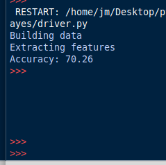
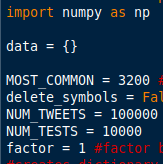

<h2>Project board link:</h2>
https://github.com/TempleS19CIS3296-01/project-tweetneurelnetwork/projects/1

<h2>Part 1:</h2>
<h3><Team Members:</h3>
<ul>
  <li>John Mancini</li>
  <li>Qunchao Zhou</li>
</ul>
 
<h2>Project Relevance:</h2>

This project is relevant to the class because it involves object oriented programming, utilizing API's, doing software development in with agile, utilizing a database, and potentially adding parallelism (although cloud computing will abstract all of this most likely). John's experience is in the python programming language and a high level understanding of neural networks. Qunchao's experience is in databases. Both team members will be new to the TensorFlow library and cloud computing with Google Collaboration.
 
  
<h2>Goals and Milestones</h2>
<ul>
  <li>Train neural network to get >50% approximations (meaning over 50 percent of its approximations are correct according to test data)</li>
  <li>Train neural network to get >70% approximations</li>
  <li>Train neural network to get >80% approximations</li>
  <li>Store weights that get >80% approximations in database</li>
  <li>Create UI that is easy to use for most users.</li>
</ul>

This will be an agile based software development process. We are going to work on the project in iterations, where in each iteration we add or enhance certain functionality
  

<h2>Work Plan:</h2>
<ul>
  <li>BOTH: Download dataset from kaggle.com</li>
  <li>BOTH: Get comfortable with TensorFlow API, perhaps by building smaller neural network</li>
  <li>BOTH: Get comfortable with google collaboration. This will be our cloud computing platform. It will make neural network calculations much faster.</li>
  <li>JOHN: Build neural network in TensorFlow until we achieve high 80% approximations for tweet mood.</li>
  <li>QUNCHAO: Store the weights that are giving us these approximations in a database</li>
  <li>BOTH: Learn how to do above in an efficient and effective way</li>
  <li>JOHN: Once we have a neural network that can fetch weights from a database that will give us good approximations, start building UI</li>
  <li>BOTH: Learn twitter API so that we can allow the user to submit a link and with that link we can analyze all of the tweets in a thread.</li>
  <li>QUNCHAO: Maybe add graphing capabilities so the user can see a visualization of the tweets they have analyzed.</li>
  <li>BOTH: Create power point and plan for presentation on what we have learned.</li>
  <li>BOTH: Plan a demonstration for the TA during the last lab to show them the project is fully functional and working.</li>
  <li>BOTH SEPERATELY: Write personal reflection on the project: What we learned, difficult bugs, how we learned, etc.</li>
</ul>

We plan to use an agile based software development strategy. From the work plan above, we want to build this project in iterations. First by learning how to build a neural network with tensorflow, then building the neural network, then storing the weights from a good neural network in a database, then building UI.

<h2>MILESTONES:</h2>
<ul>
  <li>Set up environment: This took under an hour. It simply involved downloading python3, the data set we are working with, and a few libraries with pip.</li>
  <li>Implement Naive Bayes Method on the data: This took 6-8 hours. First I had to learn what naive bayes was, which is a stochastic method for classifying things using Baye's theorem. Then I had to learn how to clean my data. Surprisingly, this was quite difficult because my data set is just one massive csv file with 800k postively rated tweets followed by 800k negatively rated tweets. After the data was "cleaned", cleaned here means that I was able to feed it properly to the sklearn library, and I trained a gaussian distribution based model with sklearn, I received 64% approximation. I was happy with anything over 50%. After tweaking the parameters I got up to 70% approximation, well above the 50% baseline.
   
    
Results:

    
    </li>

<li>Fragment data into 16 seperate files: This took about 2 hours. The first part was making sure I properly fragmented the data into 16 files. That means putting 50k positive then 50k negative tweets into 16 seperate files. The longest part was testing. Firstly, I tested to make sure the length of each file was 100k. Then I made sure each file had 50k positive and 50k negative tweets. Lastly, I made sure the tweet id, which is a unique id assigned to a tweet, was different across all files, therefore confirming that each tweet in each file is unique. From all of that I was able to conclude that the file was fragmented properly and I was finally ale to upload the data set to github.</li>

<li>Learn google colab environment: This took about 4 hours. Google colab was a decently tricky environment to get comftorable with. Firstly, I had to figure out how to actually get the code I wanted into google colab. This was the hardest part that required a good amount of research. Then I had to get accustomed to the environment. Ultimately, it came down to simply cloning the repo I want to work with into the virtual machine and navigating to the right directory.</li>
<li>Refactoring naive bayes code to work with google colab: This took about 2 hours. The previous version of the code was written to work on my local device and was confined to my local devices hardware constraints. Therefore, I had to do certain things with the train and test data as to not over use my ram. On google colab, I have more ram and computational power. So the code had to be refactored to take that into consideration. It was ultimately not difficult, and debugging in the google colab environment is straightforward. But editing code is annoying as it has to be done on a local device, pushed to github, and then pulled from github in google colab. </li>
</ul>
